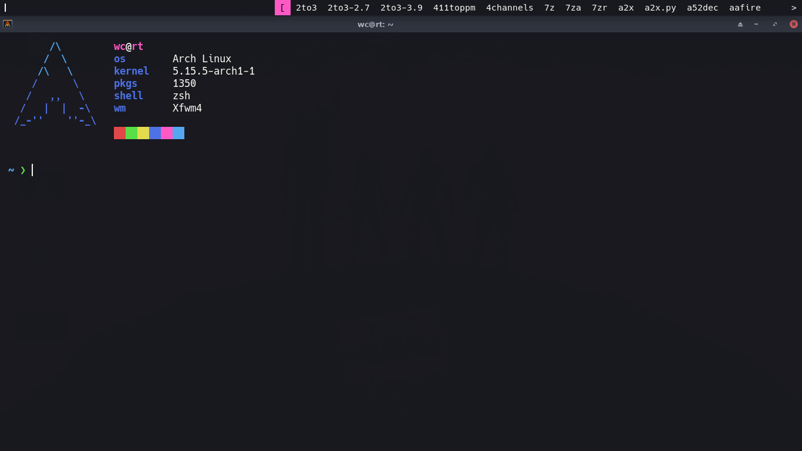

# Vampyric [dmenu](https://tools.suckless.org/dmenu)

> A dark theme for [dmenu](https://tools.suckless.org/dmenu).



## Install

1. Download the `dmenu-vd.patch` patch.
2. Apply the patch as follows to install the theme:

```sh
$ mv dmenu-vd.patch dmenu/
$ cd dmenu/
$ patch -p1 < dmenu-vd.patch
# make clean install
```

## Team

This theme maintained by:

[](https://github.com/WitherCubes) |
--- |
[WitherCubes](https://github.com/WitherCubes) |

## License

Distributed under MIT License. See `LICENSE` for more information.
